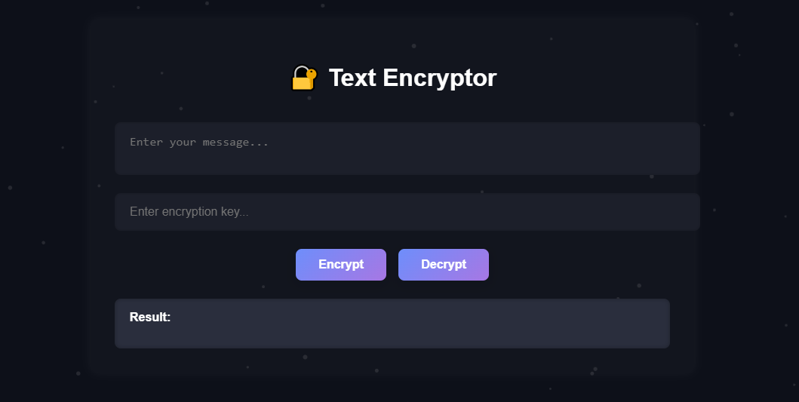

# 🔐 Text Encryptor
 
**Text Encryptor** is a modern, canvas-enhanced web application for secure message encryption and decryption. Built with modular JavaScript and SCSS architecture, it features a branded UI, animated particle background, and responsive design. Ideal for developers, educators, and privacy-conscious users.
---




## 🚀 Features

- ✨ **Canvas-based particle animation** for immersive visuals
- 🔐 **AES-style XOR encryption** with custom key input
- 🎨 **Gradient-styled UI** with responsive SCSS and dark mode
- 🧩 Modular folder structure for core logic, UI, and canvas
- 🔄 Live encryption/decryption with instant result display
- 🔑 Built-in password generator (optional module)

---


## 🛠️ Setup & Usage

### 1. Install dependencies
```bash
npm install
2. Compile SCSS
bash
sass style/main.scss style/main.css --watch
3. Launch with Live Server
bash
npx live-server
```
📦 Technologies
Vanilla JavaScript (ES Modules)

SCSS with modular architecture

HTML5 Canvas API

Live Server for local development

📜 License
This project is licensed under the MIT License. Feel free to use, modify, and distribute.

👨‍💻 Author
Murad Isazade Backend Architect & Full-Stack Developer Modular thinker. Branded builder. Secure by design.
